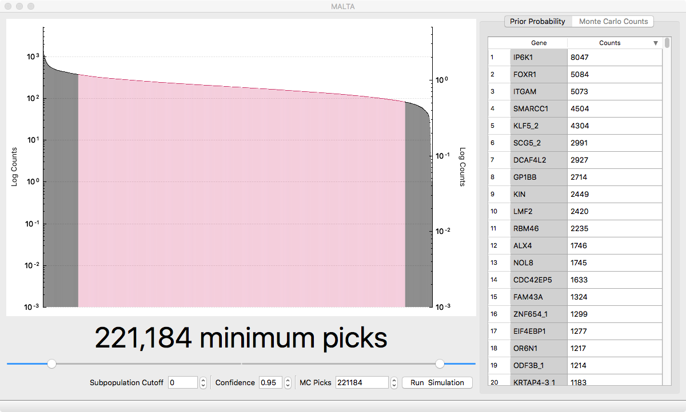

# MALTA

Objects in the **M**irror **A**ppear **L**arger **T**han **A**ctual

## Features

* Calculates the number of picks required such that each gene in a gene library is picked atleast once.
* Calculates the picks for a sliced population and subpopulation.
* Multi threaded Monte Carlo simulation to calculate average counts of library population.

## Screenshot

